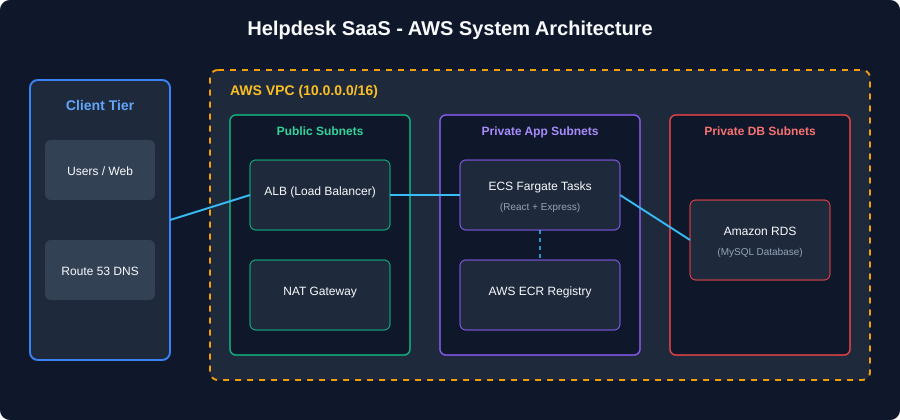
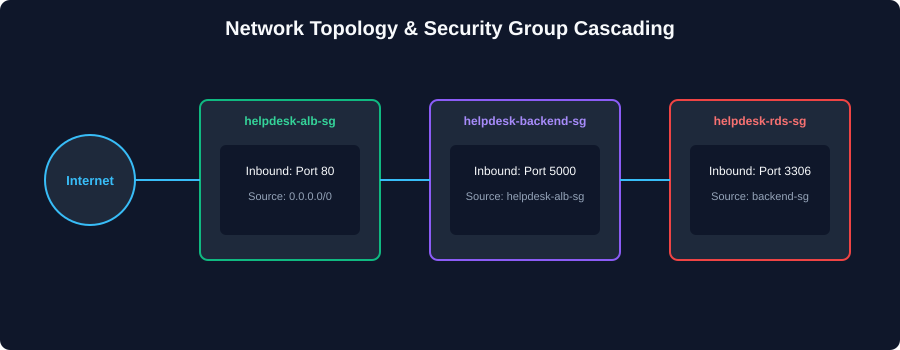

# Deploy Helpdesk SaaS on AWS Cloud Architecture



## Table of Contents

- [Deploy Helpdesk SaaS on AWS Cloud Architecture](#deploy-helpdesk-saas-on-aws-cloud-architecture)
  - [Table of Contents](#table-of-contents)
- [Project Overview](#project-overview)
  - [Introduction](#introduction)
    - [Key Features](#key-features)
  - [Architecture Overview](#architecture-overview)
    - [Infrastructure Components](#infrastructure-components)
    - [Network Architecture](#network-architecture)
- [Pre-Requisites](#pre-requisites)
  - [Required Accounts and Tools](#required-accounts-and-tools)
    - [1. AWS Account \& CLI Setup](#1-aws-account--cli-setup)
- [For Linux](#for-linux)
- [For macOS](#for-macos)
- [Configure AWS CLI Credentials](#configure-aws-cli-credentials)

---



---

# Project Overview

## Introduction

**Helpdesk SaaS** (`AkashDixit8/helpdesk`) is an enterprise-grade IT Support & Ticket Management Platform engineered using a modern decoupled architecture. The platform orchestrates the complete lifecycle of IT service requests through strict Role-Based Access Control (RBAC), supporting Customers, Support Agents, and System Administrators.

The project features a **production-oriented AWS Cloud architecture** leveraging containerization (Docker, AWS ECR), serverless container orchestration (AWS ECS Fargate), application load balancing (ALB), high-availability database hosting (Amazon RDS MySQL), and isolated VPC networking across public and private subnets.

### Key Features

- **Multi-Role Helpdesk Workflows**: Isolated views, permissions, and ticket management actions for Customers, Agents, and Administrators.
- **Internal Support Communications**: Dedicated internal agent notes (`isInternal` flag) separated from customer-visible ticket replies.
- **Microservices-Ready Container Architecture**: Decoupled React + Nginx frontend and Node.js + Express + TypeScript + Prisma backend containers.
- **Production-Grade AWS Network Isolation**: Public ALB ingress with ECS Fargate tasks running strictly inside private application subnets.
- **Database Schema Management**: Type-safe database operations and seamless migrations using Prisma ORM against Amazon RDS.
- **Zero-Trust Security Chain**: Strictly enforced security group cascading (`ALB -> Frontend/Backend -> RDS`).

## Architecture Overview

### Infrastructure Components

1. **Presentation Tier (Frontend Container)**
   - Production React + Vite single-page application compiled into static assets.
   - High-performance Nginx Alpine web server acting as reverse proxy on port 80.
   - Proxies `/api/*` requests seamlessly to backend services.

2. **Application Tier (Backend API)**
   - Express.js backend written in TypeScript running on Node.js 20.
   - Health check monitoring endpoint at `/api/health`.
   - Data access abstraction via Prisma ORM connected over MySQL port 3306.

3. **Data Tier (Database Layer)**
   - Amazon RDS MySQL running inside isolated private database subnets (`helpdesk-db-subnet-group`).
   - Non-publicly accessible database instance (`PubliclyAccessible: false`).
   - Audited schema migrations managed through `prisma migrate deploy`.

### Network Architecture

- **AWS VPC Design (`10.0.0.0/16`)**
  - **Public Subnets**: Multi-AZ (`10.0.1.0/24`, `10.0.2.0/24`) housing AWS Application Load Balancer and Regional NAT Gateway.
  - **Private Application Subnets**: Multi-AZ (`10.0.11.0/24`, `10.0.12.0/24`) housing private ECS Fargate tasks.
  - **Private Database Subnets**: Multi-AZ (`10.0.21.0/24`, `10.0.22.0/24`) housing Amazon RDS instances.
  - **Internet Access Path**: Internet Gateway (`helpdesk-igw`) for public traffic; Regional NAT Gateway (`helpdesk-nat`) for outbound private task connectivity (AWS ECR, APIs).

---

# Pre-Requisites

## Required Accounts and Tools

### 1. AWS Account & CLI Setup
- Create an [AWS Free Tier Account](https://aws.amazon.com/free/)
- Install and configure AWS CLI v2:
  ```bash
  # For Linux
  curl "[https://awscli.amazonaws.com/awscli-exe-linux-x86_64.zip](https://awscli.amazonaws.com/awscli-exe-linux-x86_64.zip)" -o "awscliv2.zip"
  unzip awscliv2.zip
  sudo ./aws/install

  # For macOS
  brew install awscli

  # Configure AWS CLI Credentials
  aws configure


  